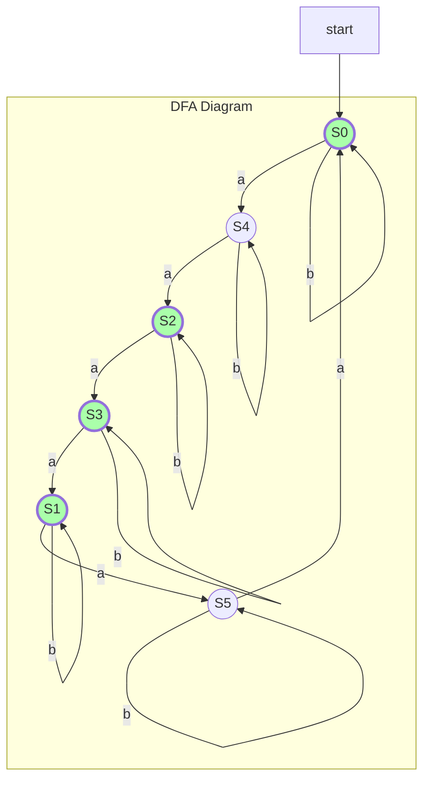

Admin Panel Repo: [https://github.com/godlykmathews/punarjani_admin_panel](https://github.com/godlykmathews/punarjani_admin_panel)

```mermaid
graph TD
    subgraph DFA Diagram
        S0((S0))
        S1((S1))
        S2((S2))
        S3((S3))
        S4((S4))
        S5((S5))
    end
    style S0 stroke-width:3px, fill:#aaffaa
    style S1 stroke-width:3px, fill:#aaffaa
    style S2 stroke-width:3px, fill:#aaffaa
    style S3 stroke-width:3px, fill:#aaffaa
    start -- " " --> S0
    S0 -- a --> S4
    S4 -- a --> S2
    S2 -- a --> S3
    S3 -- a --> S1
    S1 -- a --> S5
    S5 -- a --> S0
    S0 -- b --> S0
    S1 -- b --> S1
    S2 -- b --> S2
    S3 -- b --> S3
    S4 -- b --> S4
    S5 -- b --> S5
```
